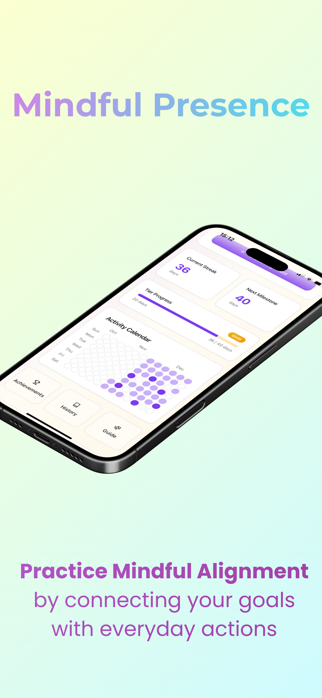
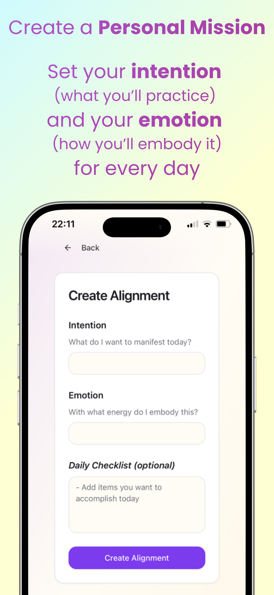
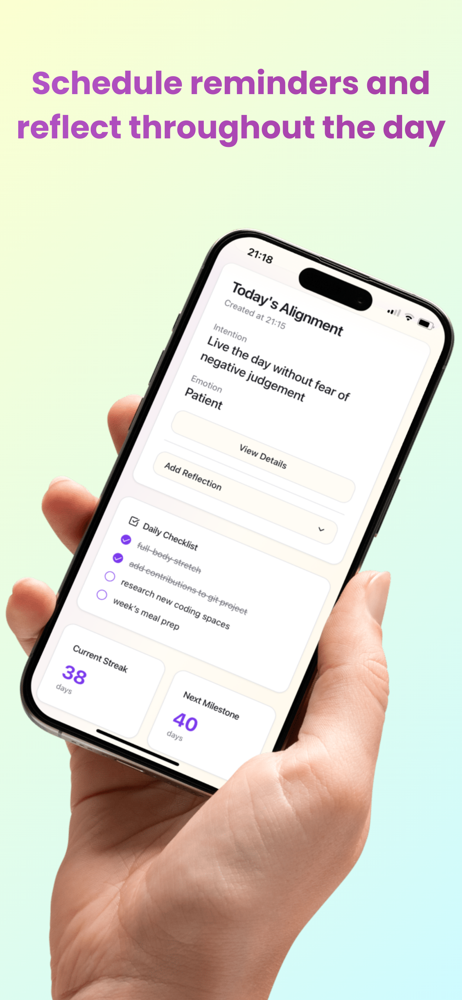
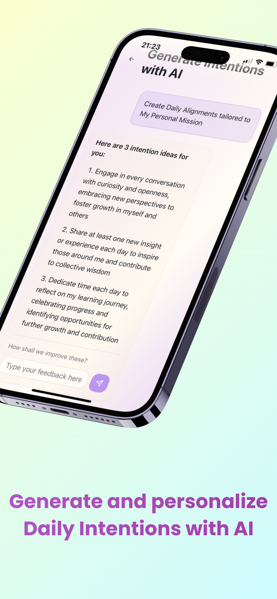
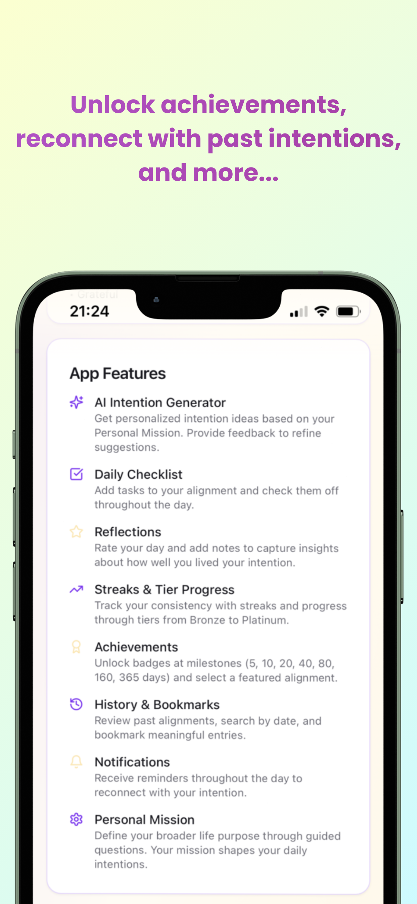

# Mindful Presence app
Native App Store Daily Alignment app - practice presence by connecting your goals with everyday actions  

**Mindful Presence is designed to help you cultivate a deeper connection with yourself through daily alignment practices. By setting clear intentions and acknowledging your emotions, you develop greater self-awareness and presence in your daily life.**

Regular practice helps you stay grounded, make conscious choices, and live more intentionally. Our approach combines ancient wisdom with modern psychology to support your journey toward mindfulness and personal growth.

# How to use

Daily alignments connect your life goals with everyday actions through two components: an intention (what you'll practice) and an emotion (how you'll embody it). 
1. Morning: Create an alignment with your intention, emotion, and optional checklist.  
2. Throughout the day: Pause when reminded to reconnect with your intention.
3. Evening: Add a reflection with a star rating and notes about your day.

# App features

⚡️AI Intention Generator  
Get personalized intention ideas based on your Personal Mission. Provide feedback to refine suggestions.

📝Daily Checklist  
Add tasks to your alignment and check them off throughout the day.

📘Reflections  
Rate your day and add notes to capture insights about how well you lived your intention.

📈Streaks & Tier Progress  
Track your consistency with streaks and progress through tiers from Bronze to Platinum.

🏆Achievements  
Unlock badges at milestones (5, 10, 20, 40, 80, 160, 365 days) and select a featured alignment.

📖History & Bookmarks  
Review past alignments, search by date, and bookmark meaningful entries.

🔔Notifications  
Receive reminders throughout the day to reconnect with your intention.

👑Personal Mission  
Define your broader life purpose through guided questions. Your mission shapes your daily intentions.

# App Store Screenshots

  

  

  

  

  

# Lovable + Despia App Deployment (steps)

Create application

Set up upload platform (despia)  
App logo,   
    Set up keys
        id k
        ons

Test Flight
    test app
    Rebuild, Troubleshoot

Push Notifications
    One signal

Retest (new) user view

App Store page
    Create 'screenshots' 
    License
Create privacy,support url
    

